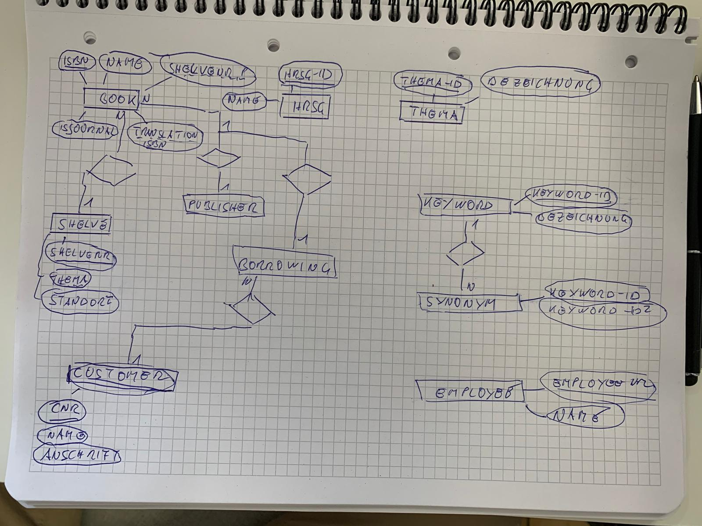

# Library-ERM
A library manages books and journals. Each book is published by a publishing house, there may be several copies of each book, which can also be borrowed by customers. There are published issues of the journals, these are only available once, a loan is not possible.
The articles published in the journals as well as the books should be managed in such a way that comfortable functions for information retrieval are possible: In addition to the assignment of a subject area, there should also be a keyword, whereby the relevance of each assigned keyword is important. Synonymous keywords should be recorded. Articles and books can each have several authors. Certain books can each have one book as a translation template, articles can reference each other:
Each borrowing is handled by one employee, and one employee is also responsible for returning the book copy.
Customers can also reserve books, each reservation usually results in a loan. The books and magazines are stored on shelves. A journal is placed on a shelf, and each shelf is assigned a subject area for the storage of the books.

* book( **isbn:int**, name: varchar(32), isjournal: boolean, *translation-isbn: int*, *shelvenr:int* )
* hrsg( **hrsg-id: int**, name: varchar(32) )
* thema( **thema-id: int**, bezeichnung: varchar(32) )
* keyword( **keyword-id: int**, keyword )
* publisher( **id: int**, name; varchar(32) )
* synonym( ***keyword-id: int, keyword-id2: int*** )
* customer( **cnr: int**, name varchar, anschrift varchar(32), ...)
* borrowing( ***cnr: int, isbn: int, lfdnr: int***, leihdatum: date, rückgabedatum: date, *mahnstufe: int*, *employeenr: int* )
* shelve( **shelvenr: int**, *thema: varchar(32)*, standort: varchar(32) )
* employee **employeenr: int**, name: varchar(32))
* author( **authorid: int**, name: varchar(32))
* article( ***isbn: int, articlenr: int*** )
* articlelist( **articelnr: int**, name: varchar(32), *authorid: int* )
* book_hrsg( ***isbn: int, hrsg_nr: int***)
* reservation( **isbn: int**, datumbis: date )

